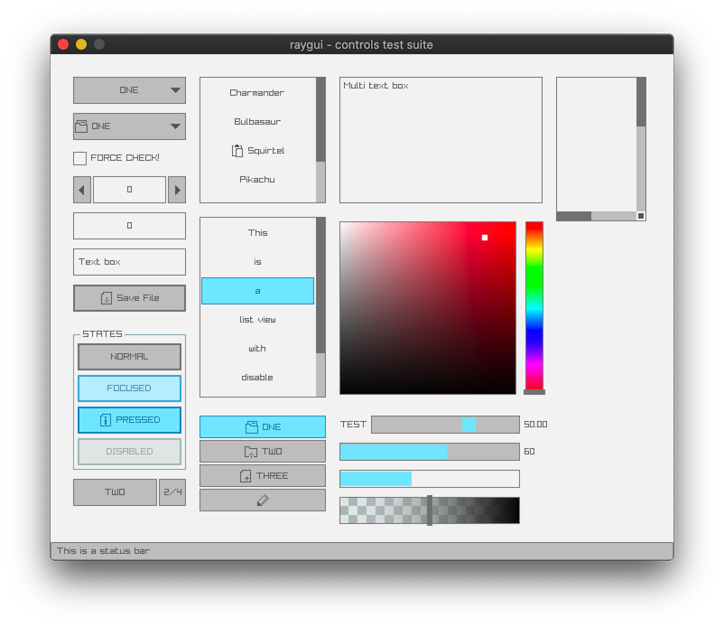

# 🌱 RayGui Scaffold

A minimal raygui project template

## 🦄 Usage

Simply click the button below to get started:

[](https://github.com/xmake-examples/raygui-scaffold/generate)

## 🔨 Development

###  📋 Requirements

To setup and use the project you will need to have the following tools installed:
 - [Xmake](https://xmake.io/)

###  ⬇️ Installation

Clone the repository

```bash
$ git clone https://github.com/xmake-examples/raygui-scaffold.git
```

Change the working directory to the newly cloned repository:

```bash
$ cd raygui-scaffold
```

Run xmake to install the dependencies & build the project:

```bash
$ xmake
note: install or modify (m) these packages (pass -y to skip confirm)?
in xmake-repo:
  -> raylib 4.0.0 [from:raygui]
  -> raygui 3.0
please input: y (y/n/m)

  => install raylib 4.0.0 .. ok
  => download https://github.com/raysan5/raygui/archive/refs/tags/3.0.tar.gz .. ok
  => install raygui 3.0 .. ok
[ 25%]: ccache compiling.release src/main.c
[ 50%]: linking.release raygui-scaffold
[100%]: build ok!
```

Run the project after it has been built:

```bash
$ xmake run
```


